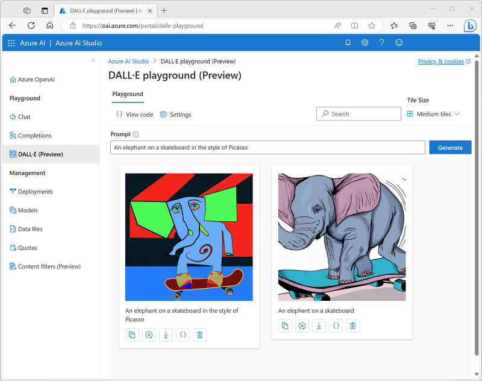

---
lab:
  title: Generación de imágenes con el modelo DALL-E
---

# Generación de imágenes con el modelo DALL-E

Azure OpenAI Service incluye un modelo de generación de imágenes denominado DALL-E. Puede usar este modelo para enviar mensajes en lenguaje natural que describan una imagen deseada y el modelo generará una imagen original basada en la descripción que proporcione.

Este ejercicio dura aproximadamente **25** minutos.

## Antes de comenzar

Necesitará una suscripción de Azure que tenga acceso a Azure OpenAI Service, incluido el modelo DALL-E. Si había solicitado previamente el acceso a Azure OpenAI Service, es posible que tenga que enviar otra solicitud para acceder a DALL-E.

- Para registrarse para obtener una suscripción gratuita de Azure, vaya a [https://azure.microsoft.com/free](https://azure.microsoft.com/free).
- Para solicitar acceso a Azure OpenAI Service, vaya a [https://aka.ms/oaiapply](https://aka.ms/oaiapply).

## Aprovisionamiento de un recurso de Azure OpenAI

Para poder usar modelos de Azure OpenAI, debe aprovisionar un recurso de Azure OpenAI en su suscripción de Azure.

1. Inicie sesión en [Azure Portal](https://portal.azure.com).
2. Cree un recurso de **Azure OpenAI** con la siguiente configuración:
    - **Suscripción**: una suscripción de Azure que tenga acceso a Azure OpenAI Service.
    - **Grupo de recursos**: elija un grupo de recursos existente o cree uno nuevo con un nombre de su elección.
    - **Región**: elija **EastUS** como región.
    - **Nombre**: elija un nombre único.
    - **Plan de tarifa**: estándar S0
3. Espere a que la implementación finalice. A continuación, vaya al recurso de Azure OpenAI implementado en Azure Portal.
4. Vaya a la página **Claves y punto de conexión**. Puede recuperar el punto de conexión único y las claves de autenticación para el servicio desde aquí; los necesitará más adelante.

## Exploración de la generación de imágenes en el área de juegos de DALL-E

Puede usar el área de juegos de DALL-E en **Azure OpenAI Studio** para experimentar con la generación de imágenes.

1. En Azure Portal, en la página **Información general** del recurso de Azure OpenAI, use el botón **Explorar** para abrir Azure OpenAI Studio en una nueva pestaña del explorador. También puede ir directamente a [Azure OpenAI Studio](https://oai.azure.com/?azure-portal=true).
2. Seleccione el **Área de juegos de DALL-E**.
3. En el cuadro **Mensaje**, escriba una descripción de una imagen que desee generar. Por ejemplo, *An elephant on a skateboard*. Después, seleccione **Generar** y vea la imagen que se genera.

    

4. Modifique el mensaje para proporcionar una descripción más específica. Por ejemplo *An elephant on a skateboard in the style of Picasso*. A continuación, genere la nueva imagen y revise los resultados.

    

## Uso de la API REST para generar imágenes

Azure OpenAI Service proporciona una API REST que puede usar para enviar mensajes para la generación de contenido, incluidas imágenes generadas por el modelo DALL-E.

### Preparación del entorno de la aplicación

En este ejercicio, usará una sencilla aplicación de Python o Microsoft C# para generar imágenes llamando a la API REST. Ejecutará el código en la interfaz de consola de Cloud Shell en Azure Portal.

1. En [Azure Portal](https://portal.azure.com?azure-portal=true), seleccione el botón **[>_]** (*Cloud Shell*) en la parte superior de la página, a la derecha del cuadro de búsqueda. Se abrirá un panel de Cloud Shell en la parte inferior del portal. 

    

2. La primera vez que abra Cloud Shell, es posible que se le pida que elija el tipo de shell que desea usar (*Bash* o *PowerShell*). Seleccione **Bash**. Si no ve esta opción, omita el paso.  

3. Si se le pide que cree almacenamiento para Cloud Shell, seleccione **Mostrar configuración avanzada** y seleccione la siguiente configuración:
    - **Suscripción**: Su suscripción
    - **Regiones de Cloud Shell**: elija cualquier región disponible
    -  **Mostrar configuración de aislamiento de VNET** No está seleccionado
    - **Grupo de recursos**: use el grupo de recursos existente en el que aprovisionó el recurso de Azure OpenAI
    - **Cuenta de almacenamiento**: cree una cuenta de almacenamiento nueva con un nombre único
    - **Recurso compartido de archivos**: cree un nuevo recurso compartido de archivos con un nombre único

    A continuación, espere un minuto más o menos a que se cree el almacenamiento.

    > **Nota**: Si ya tiene una instancia de Cloud Shell configurada en su suscripción de Azure, es posible que tenga que usar la opción **Restablecer configuración de usuario** en el menú ⚙️ para asegurarse de que están instaladas las versiones más recientes de Python y .NET Framework.

4. Asegúrese de que el tipo de shell indicado en la parte superior izquierda del panel de Cloud Shell sea *Bash*. Si es *PowerShell*, cambie a *Bash* mediante el menú desplegable.

5. Cuando se haya iniciado el terminal, escriba el siguiente comando para descargar el código de la aplicación con el que va a trabajar.

    ```bash
    rm -r azure-openai -f
    git clone https://github.com/MicrosoftLearning/mslearn-openai azure-openai
    ```

    Los archivos se descargan en una carpeta denominada **azure-openai**. Se han proporcionado aplicaciones para C# y Python. Las dos aplicaciones tienen la misma funcionalidad.

6. Vaya a la carpeta del lenguaje que desea usar ejecutando el comando correspondiente.

    **Python**

    ```bash
    cd azure-openai/Labfiles/05-image-generation/Python
    ```

    **C#**

    ```bash
    cd azure-openai/Labfiles/05-image-generation/CSharp
    ```

7. Use el siguiente comando para abrir el editor de código integrado y ver los archivos de código con los que va a trabajar.

    ```bash
    code .
    ```

    > **Sugerencia**: consulta la [documentación del editor de código de Azure Cloud Shell](https://learn.microsoft.com/azure/cloud-shell/using-cloud-shell-editor) para más información sobre cómo usarla para trabajar con archivos en el entorno de Azure Cloud Shell.

### Configuración de la aplicación

La aplicación usa un archivo de configuración para almacenar los detalles necesarios para conectarse a la cuenta de servicio de Azure OpenAI.

1. En el editor de código, seleccione el archivo de configuración de la aplicación, en función del lenguaje que prefiera.

    - C#: `appsettings.json`
    - Python: `.env`
    
2. Actualice los valores de configuración para incluir el **punto de conexión** y la **clave 1** para su instancia de Azure OpenAI Service y guarde el archivo.

    > **Sugerencia:** Puede ajustar la división en la parte superior del panel de Cloud Shell para ver Azure Portal y obtener los valores de punto de conexión y clave de la página **Claves y punto de conexión** de Azure OpenAI Service.

3. Si usa **Python**, también deberá instalar el paquete **python-dotenv** que se usa para leer el archivo de configuración. En el panel del símbolo del sistema de la consola, asegúrese de que la carpeta actual es **~/azure-openai/Labfiles/05-image-generation/Python**. A continuación, escriba este comando:

    ```bash
    pip install python-dotenv
    ```

### Visualización del código de la aplicación

Ya está listo para explorar el código que se usa para llamar a la API REST y generar una imagen.

1. En el panel del editor de código, seleccione el archivo de código principal de la aplicación:

    - C#: `Program.cs`
    - Python: `generate-image.py`

2. Revise el código que contiene el archivo y observe las siguientes características clave:
    - El código realiza solicitudes https al punto de conexión del servicio, incluyendo la clave para el servicio en el encabezado. Estos dos valores se obtienen del archivo de configuración.
    - El proceso consta de <u>dos</u> solicitudes REST: una para iniciar la solicitud de generación de imágenes y otra para recuperar los resultados.
    La solicitud inicial incluye los siguientes datos:
        - Mensaje proporcionado por el usuario que describe la imagen que se va a generar.
        - Número de imágenes que se van a generar (en este caso, una).
        - Resolución (tamaño) de la imagen que se va a generar.
    - El encabezado de la respuesta de la solicitud inicial incluye el valor **operation-location** que se usa para la devolución de llamada posterior para obtener los resultados.
    - El código sondea la dirección URL de devolución de llamada hasta que el estado de la tarea de generación de imágenes se realiza *correctamente* y, a continuación, extrae y muestra una dirección URL para la imagen generada.

### Ejecutar la aplicación

Ahora que ha revisado el código, es el momento de ejecutarlo y generar algunas imágenes.

1. En el panel del símbolo del sistema de la consola, escriba el comando correspondiente para ejecutar la aplicación:

    **Python**

    ```bash
    python generate-image.py
    ```

    **C#**

    ```bash
    dotnet run
    ```

2. Cuando se le pida, escriba la descripción de una imagen. Por ejemplo, *A giraffe flying a kite*.

3. Espere a que se genere la imagen y se muestre un hipervínculo en el panel de la consola. Seleccione el hipervínculo para abrir una nueva pestaña del explorador y revise la imagen que se ha generado.

4. Cierre la pestaña que contiene la imagen generada y vuelva a ejecutar la aplicación para generar una nueva imagen con un mensaje diferente.

## Limpieza

Cuando haya terminado de usar el recurso de Azure OpenAI, recuerde eliminar el recurso en [Azure Portal](https://portal.azure.com/?azure-portal=true).
